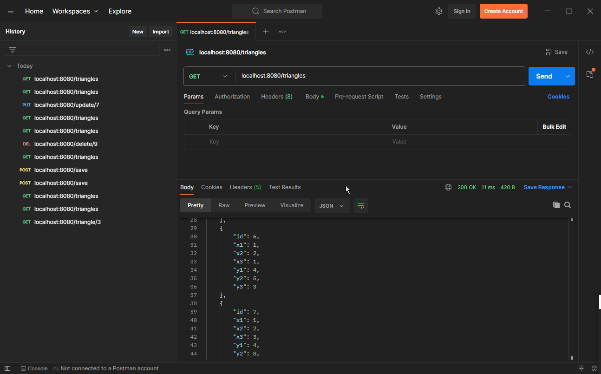

<h1 align="center">Лабораторна робота №5</h1>
<h2 align="center">Тема:Динамічне Web-програмування на мові Java. Технології Java Servlets та Java ServerPages</h2>
<h2 align="center">Виконав студент групи 6.1221</h2>
<h2 align="right">Федотов Євгеній Євгенійович</h2>
<h2 align="right">Варіант 13</h2>
<h3 align="center">Як запустити проєкт ?</h3>
Відкрити командний рядок, в директорії проекту та виконати команду: mvnw spring-boot:run
<h3 align="center">Завдання</h3>
Необходимо выполнить задание лабораторной работы №4, предполагая, что меню функций находится в JSP странице и вызывает соответствующий сервлет, который делает выборку из БД с помощью соответствующего запроса. Можно использовать запоросы и БД, созданные в лабораторной работе №4.
<h3>Результат виконання роботи:</h3>

